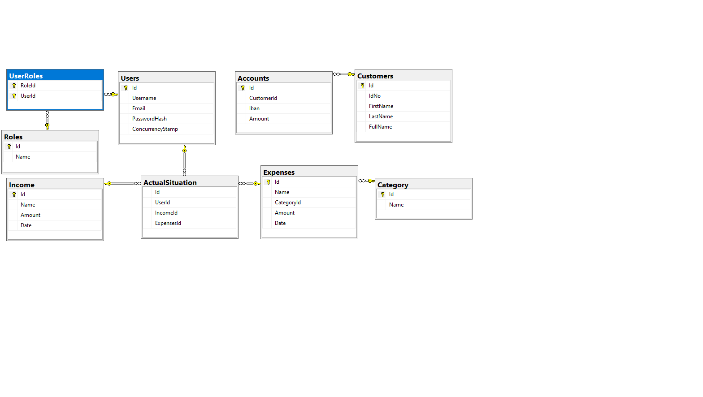
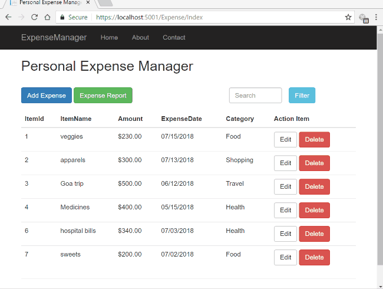

# ExpensesTracker
An application to help people manage money.
This project was created based on the idea of financial management. As a student, you have to use your money as efficiently as possible to deal with payments, but also to create a comfortable life.

# DataBase

The database is presented below. We made an image of the created tables that are used in the application and also the connections between them.

# The purpose of this application:
1. Constantly see how much money you have in your account
1. You can see how much money you spent in a month
1. You have the option to see which category of expenses is the highest

# A Simple Exemple

